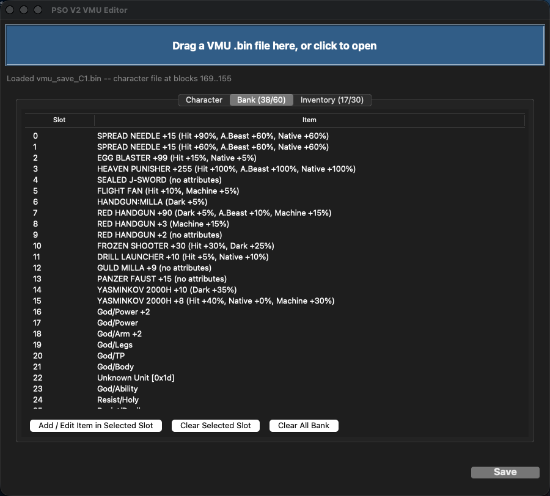

# PSO V2 VMU Editor (MVP)

Drag-and-drop editor for PSO Dreamcast V2 character VMU save files.



## Running

**macOS**: double-click `run.command` (it sets up a venv with `tkinterdnd2` on
first run). If you'd rather run it manually, use Homebrew's Python rather than
the system `/usr/bin/python3` -- macOS's bundled Python ships an old Tcl/Tk
that renders the window blank:
```
cd ~/PSOVMUEditor
/opt/homebrew/bin/python3 main.py
```

**Windows**: double-click `run.bat` (same first-run venv setup), or from a
terminal:
```
cd PSOVMUEditor
python main.py
```
The official python.org installer for Windows already includes a modern
Tcl/Tk, so no special interpreter path is needed there.

Either platform needs `tkinterdnd2` installed (`pip install -r
requirements.txt`) for drag-and-drop; without it the app still runs, just with
a "click to open" file picker instead of a drop target.

## Usage

1. Drag a VMU `.bin` file onto the window (or click it to open a file picker).
2. Enter the disc/account serial number when prompted (this is the decryption key
   for the save — if it's wrong you'll get a checksum-mismatch error and can retype
   it). This is an 8-character hex value, e.g. `12345678`; it's tied to your
   PSO disc/account, not something this project can supply.
3. **Character tab**: edit level/EXP/meseta/stats directly, or use "Sync EXP + stats
   to Level field" to auto-fill correct values from the real game's level-up table
   (preserves any Material-item stat bonuses already earned). "Unlock ALL quest
   flags" opens every area/difficulty.
4. **Bank / Inventory tabs**: select a slot, click "Add / Replace Item in Selected
   Slot" to open the item builder (choose a category, then a specific item, then
   any customizable fields like grind/attributes/mag stats/tech level).
5. Click **Save**. A `.bak` backup of the original file is made the first time you
   save; the app re-encrypts, verifies the round-trip, writes to disk, then
   re-reads the saved file fresh to confirm it's valid before reporting success.

## What's covered (curated item lists from the research session)

- Guns, Swords, Wands: all 8★+ weapons plus their S-rank category placeholders
- Armor, Shields, Units: all 9★+ items with legit max stats
- Mags: all 58 species (build any level/stat/synchro/IQ/color/photon-blast combo)
- Technique disks: all 19 techniques at any level
- Parts: the 46 real "special quest item" entries (enemy parts, hearts, kits, amps)

This is **not the full game item catalog** — see the "v2" phase note in project
history: a complete catalog needs the game's own text table (`unitxt`) decoded for
full accurate names, which is a separate, larger effort.

## Project layout

```
main.py                        GUI (tkinter + tkinterdnd2)
psovmu/crypto.py                PSOV2Encryption / ShuffleTables / encrypt/decrypt_fixed
psovmu/vmu.py                   VMU directory parsing, FAT chains, splice-and-save
psovmu/character.py             Character struct field access, level-table sync logic
psovmu/items.py                 Item byte encoders/decoders for every item type
psovmu/item_database.py         Curated item lists (names/stats/byte codes)
psovmu/data/level-table-v1-v2.json   Real per-class level-up stat curves
```

See [docs/REFERENCE.md](docs/REFERENCE.md) for the deeper technical writeup --
encryption derivation, full struct offsets, and gotchas found during
reverse-engineering (useful if you're extending item/character support).

## License

MIT — see [LICENSE](LICENSE).
